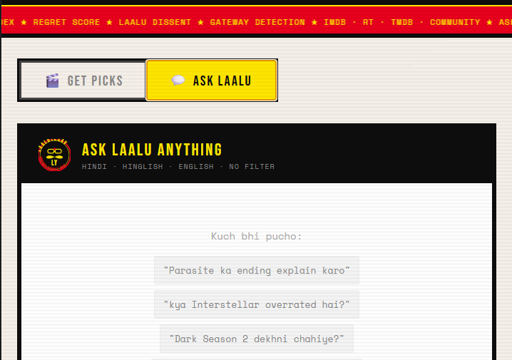

# 🧔 Laaluyadav — UNEMPLOYABLE UNC   

Desi uncle certified movie & TV recommendations. Community sentiment. No filmy nonsense.

---

## What is this?

Laaluyadav is a movie and TV show recommendation engine that goes beyond IMDB scores and critic reviews. It reads real audience conversations, extracts emotional signals, and ranks films by what people actually *felt* — not what critics wrote.

---

## Screenshots

### Search Interface

### Ask Laalu Chat

---

## What makes it different from Google?

| Feature | Google/IMDB | Laaluyadav |
|---|---|---|
| Scores | Critic + general public | Audience sentiment weighted |
| Language | English only | Hindi, Hinglish, English |
| Context | None | "khaate hue", "2 baje akele", "date night" |
| Emotional DNA | ✗ | ✓ — "Broke me at 2am", "Rewatch changes everything" |
| Rewatch Index | ✗ | ✓ — how often people rewatch |
| Regret Score | ✗ | ✓ — "wish I found this sooner" |
| Laalu Dissent | ✗ | ✓ — flags overhyped & underseen films |
| Gateway | ✗ | ✓ — rabbit holes each film opens |
| Why This | ✗ | ✓ — why THIS film for YOUR specific query |
| Ask Anything | ✗ | ✓ — chat in any language |

---

## Scoring System
